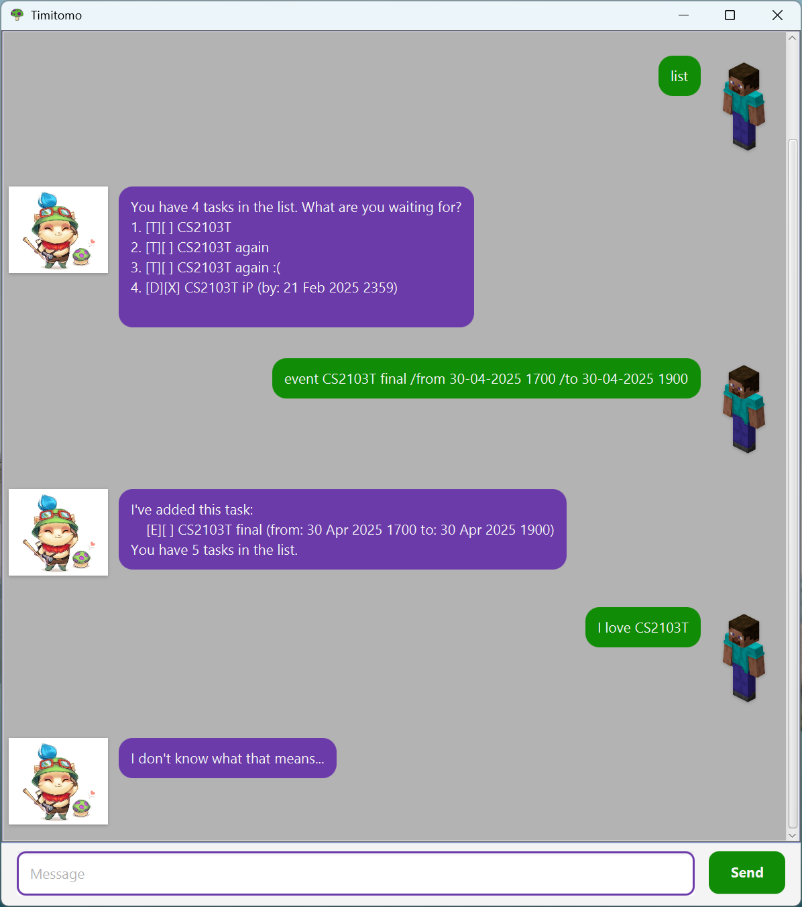

# Timitomo User Guide

<!-- Adapted from https://se-education.org/addressbook-level3/UserGuide.html#features. -->

Timitomo is a chatbot designed to help you organize your tasks effortlessly, making task management simple and stress-free.



## Quick start

1. Ensure that you have Java 17 or above installed on your device.
1. Download the latest `.jar` file from [here](https://github.com/ryanlow64/ip/releases/tag/A-Release).
1. Copy the `.jar` file to the folder you want to use as the _home folder_ for your chatbot.
1. Open a command terminal, `cd` into the folder you put the `.jar` file in, and run the command `java -jar timitomo.jar` to start the application.
1. Use commands to interact with the chatbot. Refer to the [Features](#features) below for more details.

## Features

Timitomo can support 3 different kinds of tasks:

* ToDo: A basic task
* Deadline: A task with a due date
* Event: A task with a start and end date & time

\** _More features to be released soon!_

Here's a partial list of available commands:

* todo
* deadline
* event
* mark
* delete
* find
* list

Each command has the form

```
<command> <argument(s)>
```

## Glossary of Commands

### Bye

Exits Timitomo.

`bye`

```
bye
```

### Confirm

Confirms a time slot for a tentative `Event` task.

`confirm <task index> <time slot index>`

```
confirm 7 1
```

### Deadline

Creates a task with a due date.

`deadline <description> /by <due date>`

```
deadline Submit Assignment /by 30-04-2025 1700
```

### Delete

Deletes a task.

`delete <task index>`

```
delete 2
```

### Event

Creates a task with a start and end date & time.
The start and end dates can either be confirmed, or tentative.

- `event <description> /from <start> /to <end>`
- `event <description> /slot <start> /to <end> /slot <start> /to <end> ...`

```
event World Cup Final /from 18-12-2022 1800 /to 18-12-2022 2100
event Holiday Trip /slot 09-09-2030 /to 15-09-2030 /slot 16-09-2030 0115 /to 26-09-2030 /slot 04-06-2030 /to 15-06-2030 1840
```

### Find

Finds all tasks containing a specific keyword

`find <keyword(s)>`

```
find bills
```

### List

Lists all tasks

`list`

```
list
```

### Mark

Marks a task as done.

`mark <task index>`

```
mark 2
```

### ToDo

Creates a basic task.

`todo <description>`

```
todo grocery shopping
```

### Unmark

Marks a task as not done (unmark).

`unmark <task index>`

```
unmark 2
```
